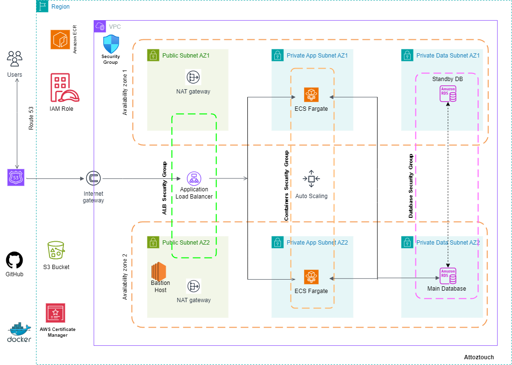

# Dynamic Web App Deployment on AWS

This project involves hosting a dynamic web application on AWS using various AWS services and resources to ensure reliability, scalability, and security. Below is a comprehensive guide detailing the steps and components used in the deployment process.

## Table of Contents
1. [Architecture Overview](#architecture-overview)
2. [Prerequisites](#prerequisites)
3. [Setup Guide](#setup-guide)
    1. [Configure Virtual Private Cloud (VPC)](#configure-virtual-private-cloud-vpc)
    2. [Deploy Internet Gateway](#deploy-internet-gateway)
    3. [Establish Security Groups](#establish-security-groups)
    4. [Leverage Availability Zones](#leverage-availability-zones)
    5. [Utilize Public Subnets](#utilize-public-subnets)
    6. [Set Up MySQL RDS Instance](#set-up-mysql-rds-instance)
    7. [Set Up Bastion Host](#set-up-bastion-host)
    8. [Create S3 Bucket](#create-s3-bucket)
    9. [Create IAM Role](#create-iam-role)
    10. [Create ECS Cluster](#create-ecs-cluster)
    11. [Create Task Definition](#create-task-definition)
    12. [Create ECS Service](#create-ecs-service)
    13. [Position Web Servers](#position-web-servers)
    14. [Employ Application Load Balancer](#employ-application-load-balancer)
    15. [Utilize Auto Scaling Group](#utilize-auto-scaling-group)
    16. [Secure Communications](#secure-communications)
    17. [Create HTTPS Listener](#create-https-listener)
    18. [Register Domain Name](#register-domain-name)
    19. [Configure SNS](#configure-sns)
4. [Conclusion](#conclusion)

## Architecture Overview
The architecture leverages multiple AWS services to deploy a dynamic web application in a highly available, scalable, and secure environment. Key components include VPC, ECS, RDS, ALB, Auto Scaling Group, and more, distributed across multiple Availability Zones.

## Prerequisites
- AWS account
- Basic understanding of AWS services (VPC, EC2, RDS, ECS, ALB, etc.)
- Domain name registered in Route 53

## Setup Guide

### Configure Virtual Private Cloud (VPC)
1. Create a VPC with both public and private subnets across two different availability zones to ensure high availability.
2. Allocate CIDR blocks for the subnets.

### Deploy Internet Gateway
1. Attach an Internet Gateway to the VPC to enable internet access for instances in public subnets.

### Establish Security Groups
1. Create security groups to act as a network firewall, specifying inbound and outbound rules to control traffic to the instances.

### Leverage Availability Zones
1. Distribute resources across two availability zones to enhance fault tolerance and reliability.

### Utilize Public Subnets
1. Use public subnets for infrastructure components like NAT Gateway and Application Load Balancer to manage traffic.

### Set Up MySQL RDS Instance
1. Launch a MySQL RDS instance in the private subnet for secure database management.

### Set Up Bastion Host
1. Create a Bastion host in the public subnet with an EC2 instance to securely migrate the MySQL database to the RDS instance using Flyway.

### Create S3 Bucket
1. Create an S3 bucket to store the environment files required by the ECS tasks.

### Create IAM Role
1. Create an IAM role (`ecstaskexecutionrole` policy) for the ECS Task definition to allow ECS tasks to call AWS services on your behalf.
2. Add an inline policy to the role with action `GetObject` on the S3 bucket.

### Create ECS Cluster
1. Create an ECS Cluster to manage the ECS containers running the web application.

### Create Task Definition
1. Define the ECS task, specifying the Docker image and required resources.

### Create ECS Service
1. Deploy the web application by creating an ECS service using the task definition.

### Position Web Servers
1. Deploy web servers (ECS containers) and RDS instances in both the private application and data subnets to enhance security.

### Employ Application Load Balancer
1. Set up an Application Load Balancer and target group to evenly distribute traffic across the ECS containers.

### Utilize Auto Scaling Group
1. Create an Auto Scaling Group to automatically manage ECS containers, ensuring availability and scalability.

### Secure Communications
1. Use AWS Certificate Manager to secure application communications with SSL/TLS certificates.

### Create HTTPS Listener
1. Set up an HTTPS listener for the Application Load Balancer to handle secure traffic.

### Register Domain Name
1. Register the domain name and configure DNS records using Route 53 to route traffic to the Application Load Balancer.

### Configure SNS
1. Set up Simple Notification Service (SNS) to send alerts regarding activities within the Auto Scaling Group.

## Conclusion
By following this guide, you will have a dynamic web application deployed on AWS, utilizing best practices for high availability, security, and scalability. This architecture ensures that the web application can handle varying loads and remains secure and highly available across multiple Availability Zones.
